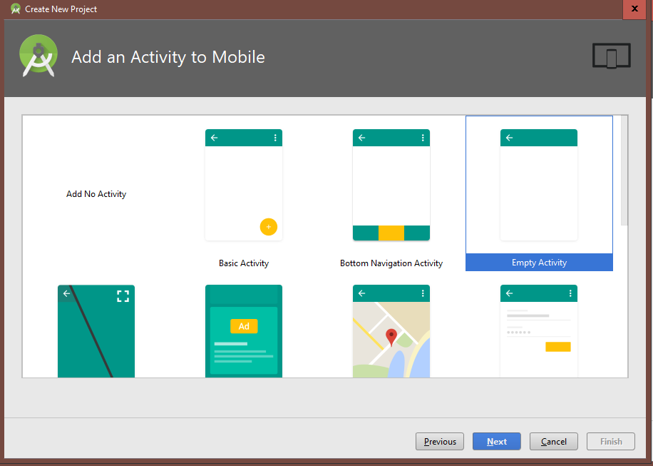

# Topic 1

https://edward2.solent.ac.uk/course/mad/part1.xhtml

Note if you cannot find the avd manager Tools/Android/AVD Manager follow the following link: 
https://stackoverflow.com/questions/46948322/how-to-open-avd-manager-in-android-studio-3-0-version

Note there may be some changes between the images in the class example and Android 3
The following images apply to Android 3

