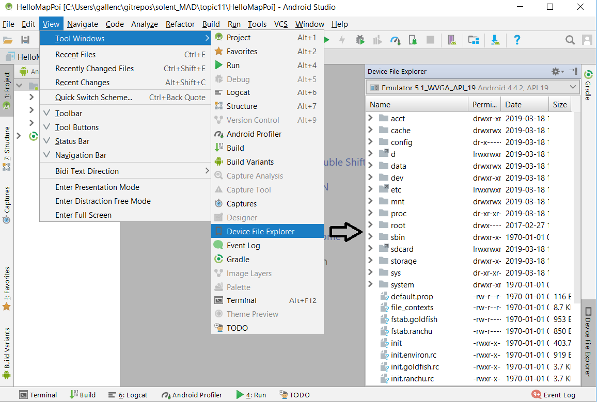

## Topic 11 Map Markers

See notes [Topic 11 Map Markers](https://edward2.solent.ac.uk/course/mad/part11.xhtml) 

the file managers DDMS is depreciated. To open device file monitor on Android Studio 3.1.4 use 

View> Tool Windows> Device File Explorer

