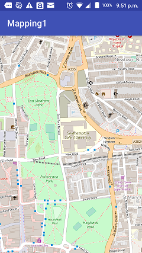
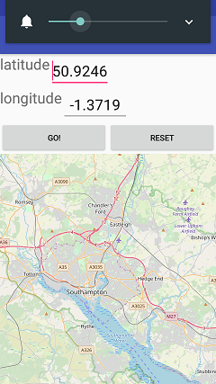

# Topic 3 Mapping

https://edward2.solent.ac.uk/course/mad/part3.xhtml

## Exercise 1

Mapping1 is class example and Exercise 1

## Exercise 2

Mapping2 is more advanced Exercise 2

I have added in extra buttons to reset the map and also error handling for out of range lat/long entries.

